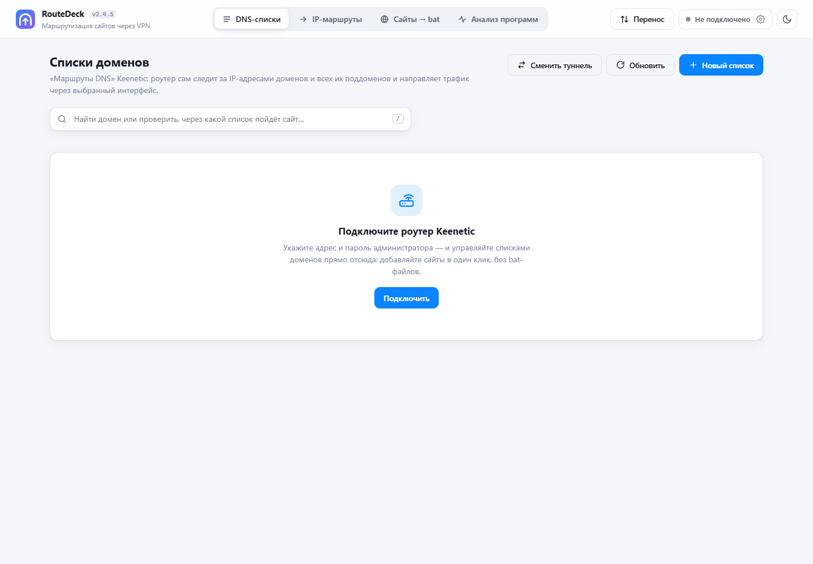
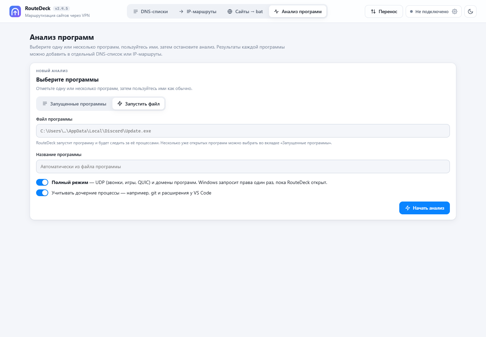

# RouteDeck

**Сайты и программы через нужный VPN-туннель на Keenetic — в одном окне.**

RouteDeck — настольная программа для Windows с локальным веб-интерфейсом. Она управляет DNS-списками и IP-маршрутами роутера Keenetic через RCI API. Ранее проект назывался **Sites4Router**.

## Интерфейс





Настоящий интерфейс версии 2.4.5, запущенный из исходников с отдельной пустой базой. Роутер не подключён; анализ трафика не запускался. Личные настройки и история в снимках отсутствуют.

## Возможности

| Раздел | Что можно сделать |
| --- | --- |
| Маршруты DNS | Создавать списки доменов и подсетей, назначать интерфейс VPN, включать и выключать правила, переключать туннель для нескольких списков. |
| IP-маршруты | Управлять маршрутами IPv4, группировать по описанию, менять интерфейс, копировать и экспортировать маршруты. |
| Сайты → BAT | Получать IP через несколько DNS-серверов и создавать BAT-файлы для импорта маршрутов. |
| Анализ программ | Находить домены и IP выбранной программы, сохранять результаты и переносить выбранные записи в DNS-списки или IP-маршруты. |
| Перенос | Экспортировать и импортировать DNS-списки и IP-группы между роутерами, сопоставляя интерфейсы. |

Обычный анализ использует таблицу TCP-соединений Windows и кэш DNS. Полный анализ запускает отдельный сборщик ETW с подтверждением UAC; он поддерживает UDP, DNS и извлечение SNI. До запуска анализа сборщик не работает.

## Готовая программа

Скачайте `RouteDeck.exe` из **Releases** этого репозитория и запустите на Windows 10/11. Python для EXE не требуется. Для встроенного окна используется Microsoft Edge WebView2; при его отсутствии предусмотрен запуск интерфейса в браузере.

Нажмите **Настройки роутера**, укажите адрес Keenetic и учётные данные, затем выберите нужный VPN-интерфейс. Туннель на роутере должен быть настроен заранее. Для DNS-маршрутизации нужны соответствующие функции KeeneticOS (в README исходного проекта указаны версии 4.3+/5.x).

Данные EXE хранятся в `%APPDATA%\RouteDeck`: база сайтов, настройки, журналы и история анализа. На Windows пароль защищается DPAPI для текущей учётной записи. Эти файлы не входят в репозиторий.

## Запуск из исходников

Нужен Python 3 в Windows; для сборочных BAT-файлов — Python Launcher `py`.

```powershell
py -3 -m venv .venv
.\.venv\Scripts\Activate.ps1
python -m pip install -r requirements.txt
python desktop.py
```

Для запуска веб-интерфейса можно использовать `start.bat`: сервер слушает `127.0.0.1:5000`. Настольный режим выбирает свободный локальный порт, предпочитая `47815`.

Чтобы работать с отдельной базой при запуске исходников:

```powershell
$env:S4R_DATA_DIR = "$env:TEMP\RouteDeck-demo"
python desktop.py
```

## Сборка и проверки

```powershell
.\build.bat
py -3 -m unittest discover -s tests -v
py -3 tests\run_browser_capture.py
py -3 tests\run_browser_capture.py --suite dns
py -3 tests\run_browser_capture.py --suite ip
```

`build.bat` устанавливает зависимости сборки, создаёт значок и сведения о версии, затем собирает `dist\RouteDeck.exe` через PyInstaller. Проверки браузера используют установленный Chrome и тестовые ответы, не настоящий роутер.

## Структура проекта

```text
app.py, desktop.py, version.py   сервер, настольное окно, версия
services/                       Keenetic, база, DNS, перенос, анализ трафика
templates/, static/             HTML, JavaScript, CSS и значки
tools/                          генерация ресурсов сборки
tests/                          проверки логики и интерфейса
build.bat, RouteDeck.spec        сборка EXE
docs/                           снимки и инструкции синхронизации
```

Локальные базы, настройки, списки пользователя, резервные копии, журналы, профиль браузера и результаты сборок исключены. EXE распространяется отдельно как asset релиза. [Как устроена локальная синхронизация](docs/sync.md).

## Подсказки по маршрутизации

DNS-списки удобны для сайтов с меняющимися IP и CDN: запись домена охватывает поддомены. Устройства должны обращаться к DNS роутера, чтобы Keenetic видел запросы. IP-маршруты подходят для известных подсетей сервисов. Эксклюзивный маршрут позволяет запретить прямой выход при недоступном туннеле.
